# Report Draft (2026-06-03)

## 1) Executive Summary

This update includes two completed tracks:

- Track A: revised T-GCN pipeline designed to keep as many sensors and timesteps as possible while controlling data quality.
- Track B: downstream Task 1 regional-anomaly analysis using connected high-error events in frequency deviation and RoCoF.

Headline outcomes:

- Main model on test split (original units): MSE 0.0234, MAE 0.0732, RMSE 0.1530, R2 0.9361.
- Feature-level test R2: freq_dev 0.8933, volt_dev 0.9359.
- High-coverage run retained 94.85% of aligned timesteps (819,582 / 864,064).
- Downstream Task 1 detected 28 connected regional cluster events (107 sensors, 4,087 samples in task summary).
- Recurring hotspot pairs are stable and interpretable (for example 774-1055, 984-2009, 792-1491).

---

## 2) Track A: Main Model Revision (Max Sensor/Time Coverage)

### 2.1 What changed in data processing

Compared with earlier workflow, the revised pipeline adds stronger alignment, coverage filtering, and robust preprocessing:

- Sensor alignment by start-time offsets at sample_rate_hz = 10.0.
- Keep only timesteps where observed sensor ratio >= min_step_coverage = 0.8.
- Robust gap handling:
  - short gaps (<= 10 steps): interpolation.
  - medium gaps (<= 300 steps): forward/backward fill.
  - fallback imputation uses train-segment statistics.
- Train-only feature scaling with robust center/scale and clipping:
  - feature_scaling = robust.
  - scaled_clip_value = 10.0.
- Explicit held-out pred segment for post-test analysis:
  - train/val/test/pred fractions = 0.8/0.05/0.05/0.1.

Coverage impact from current run:

- kept_timestep_ratio = 0.94852.
- kept_timesteps = 819,582.
- total_aligned_timesteps = 864,064.

After the cov80 filter keeps only timesteps with at least 80% observed sensors, some sensor-feature entries can still be missing inside those retained timesteps. We do not use random synthetic generation. Instead, we apply deterministic imputation per sensor and per feature channel.

Imputation sequence (for each sensor column in each feature matrix: freq_dev, rocof, angle_delta, volt_dev):

1. Short-gap linear interpolation:
  - Fill missing runs up to short_gap_steps = 10 using linear interpolation.
  - Interpolation is bidirectional so edge-adjacent gaps can be filled from nearby values.
2. Medium-gap carry fill:
  - Remaining gaps up to medium_gap_steps = 300 are filled with forward fill, then backward fill.
3. Final fallback value:
  - Any still-missing entries are filled with the train-only median for that sensor-feature column.
  - If no observed train values exist for that sensor-feature column, fallback is 0.0.

Important details:

- The fallback statistic is computed only from the training timeline to avoid leakage from val/test/pred periods.
- The observed_mask channel is kept in model inputs, so the model can still distinguish originally observed versus imputed states.
- Therefore, cov80 ensures sufficient cross-sensor coverage per timestep, while this imputation policy ensures complete tensors for training windows.

Window-pair accounting (Tin = 100, H = 10, stride = 10):

- Minimum timesteps per pair = Tin + H = 110.
- Pair count formula per split: floor((L - Tin - H) / stride) + 1 for split length L >= 110.
- Split lengths after filtering and time split:
  - train length: 655,665 timesteps
  - val length: 40,979 timesteps
  - test length: 40,979 timesteps
  - pred length: 81,958 timesteps
- Pair counts used by training/evaluation datasets:
  - train pairs: 65,556
  - val pairs: 4,087
  - test pairs: 4,087
  - pred pairs: 8,185
- Total pairs across all splits: 81,915.
- Reference only: if no split boundaries were enforced, the full kept timeline would yield 81,948 stride-10 pairs; 33 boundary-crossing pairs are intentionally excluded.

### 2.2 Input and output features (what changed)

Dynamic input channels now include 5 features per node-time:

- freq_dev (delta frequency)
- rocof
- angle_delta
- volt_dev
- observed_mask

Model targets are 2 channels:

- freq_dev
- volt_dev

Interpretation:

- We still use richer dynamics in the input state, but prediction/evaluation is now focused on the two primary response channels used in analysis and downstream detection.

### 2.3 Training/evaluation setup used in this run

- Tin = 100, H = 10
- hidden_dim = 64, num_layers = 2
- batch_size = 128
- epochs = 50
- strides train/val/test/pred = 10/10/10/10

### 2.4 Main performance results

#### A) Test split metrics from summary_metrics (shape 4087 x 10 x 107 x 2)

Overall (both targets, original units):

- MSE: 0.023397
- MAE: 0.073161
- RMSE: 0.152962
- R2: 0.936135
- sMAPE: 52.0533
- WAPE: 27.5216

By feature:

- freq_dev: MSE 2.7363e-05, MAE 0.003427, RMSE 0.005231, R2 0.893312
- volt_dev: MSE 0.046767, MAE 0.142895, RMSE 0.216258, R2 0.935942

#### B) Run config metrics snapshot (results_masked_cov80_full_scaled/config.json)

Scaled-domain test metrics:

- MSE 0.053399, MAE 0.147260, RMSE 0.231082, R2 0.946391

Original-domain test metrics:

- MSE 0.020316, MAE 0.065925, RMSE 0.142533, R2 0.949928

Pred-holdout original metrics:

- MSE 0.100996, MAE 0.092104, RMSE 0.317799, R2 0.796753

Note: pred split is expected to be harder than test split and is used here as a stronger stress check.

### 2.5 Sensor-level behavior (pred split, horizon-reduced)

Per-sensor R2 distribution from summary_per_sensor:

- freq_dev:
  - median R2 about 0.949
  - 72/107 sensors above 0.9
  - 18/107 below 0.5
- volt_dev:
  - median R2 about 0.741
  - 30/107 sensors above 0.9
  - 46/107 below 0.5
  - 20 sensors negative R2 (includes outlier cases with near-constant target behavior)

Interpretation:

- Frequency predictions are broadly stable across sensors.
- Voltage performance is more heterogeneous and should be the primary target for next-stage robustness work.

### 2.6 Quick cov80 results recap (for fast recall)

Core cov80 setup:

- Coverage threshold: min_step_coverage = 0.8
- Kept timesteps: 819,582 / 864,064 (94.85%)
- Sensors: 107
- Tin/H: 100/10
- Total split pairs: 81,915 (train 65,556; val 4,087; test 4,087; pred 8,185)

Main test results (original units):

- MSE: 0.020316
- MAE: 0.065925
- RMSE: 0.142533
- R2: 0.949928

Pred holdout (original units):

- MSE: 0.100996
- MAE: 0.092104
- RMSE: 0.317799
- R2: 0.796753

---

## 3) Track A Evidence Plots

### 3.1 Global diagnostics

- Learning curves:

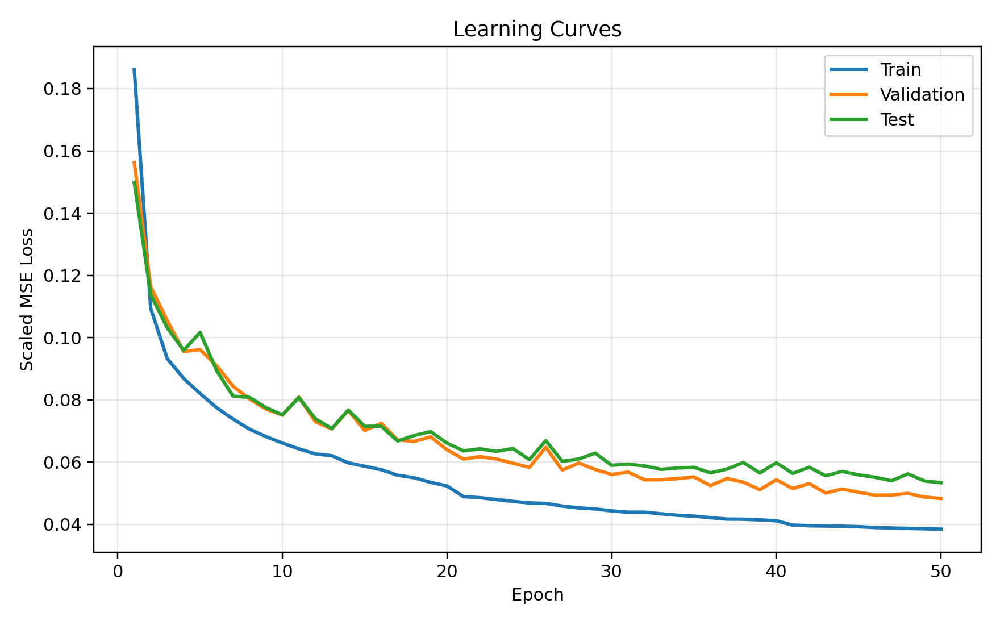

- Parity plot:

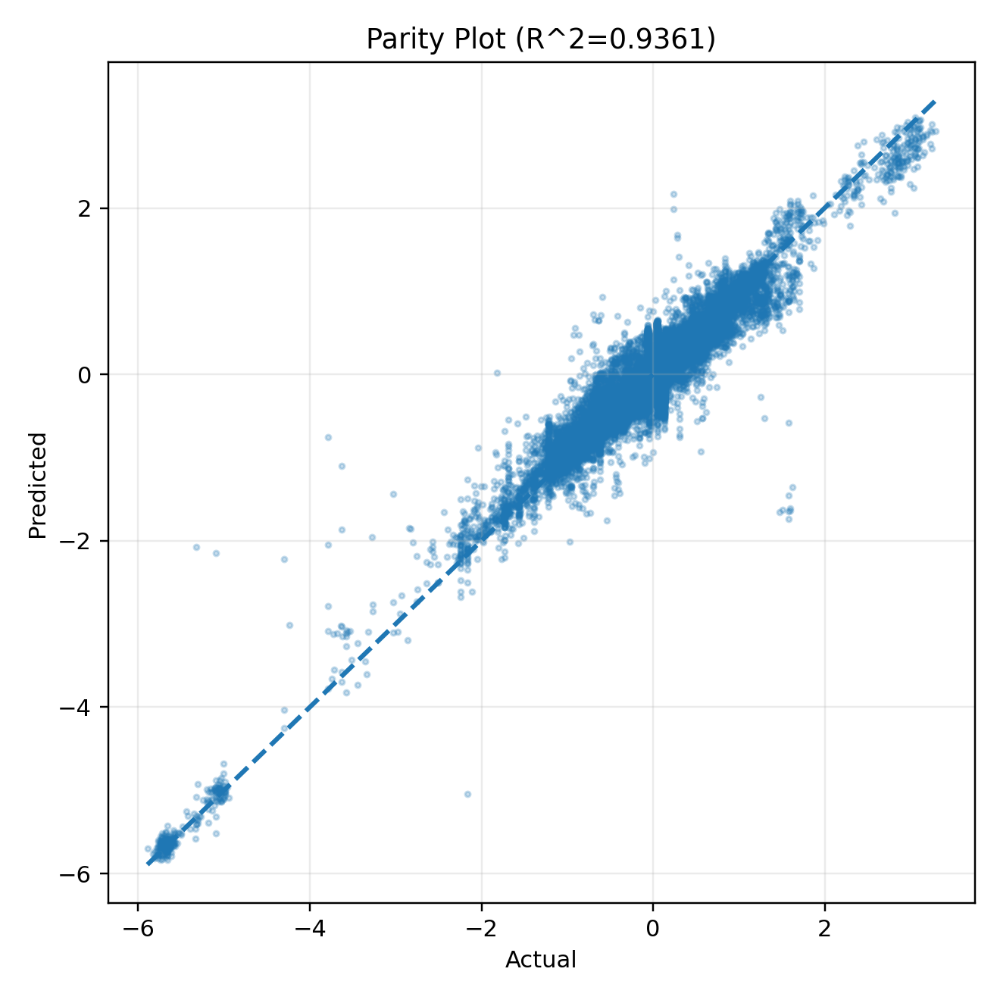

- Residual distributions:

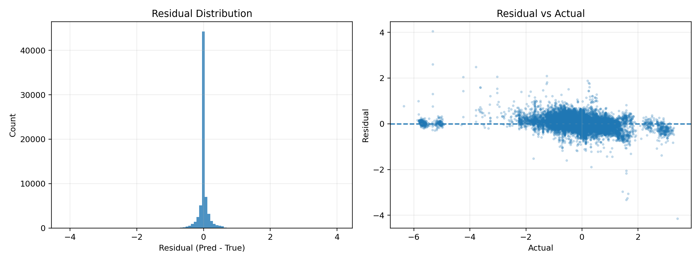

<!-- - Timeseries overlays:

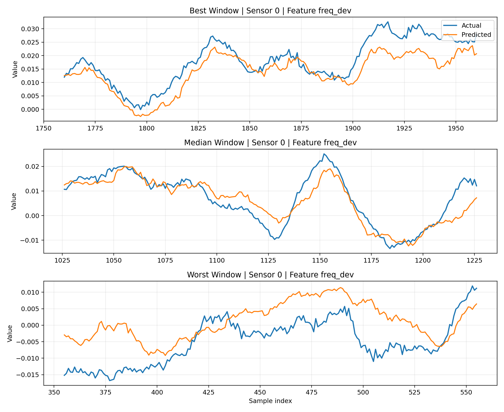 -->

<!-- - Sensor-horizon MAE heatmap:

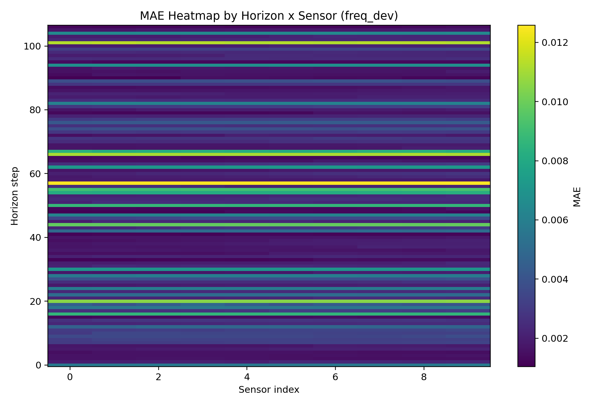 -->

- Absolute error CDF:

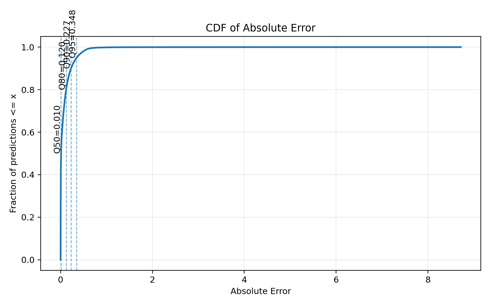

### 3.2 Full-window, all-sensor plots

- Frequency overlay and heatmaps:

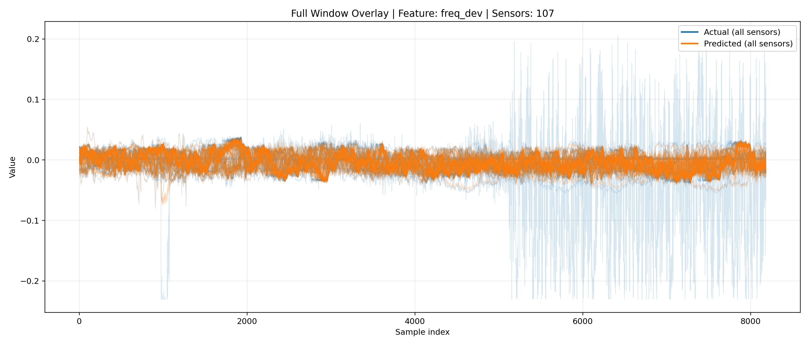

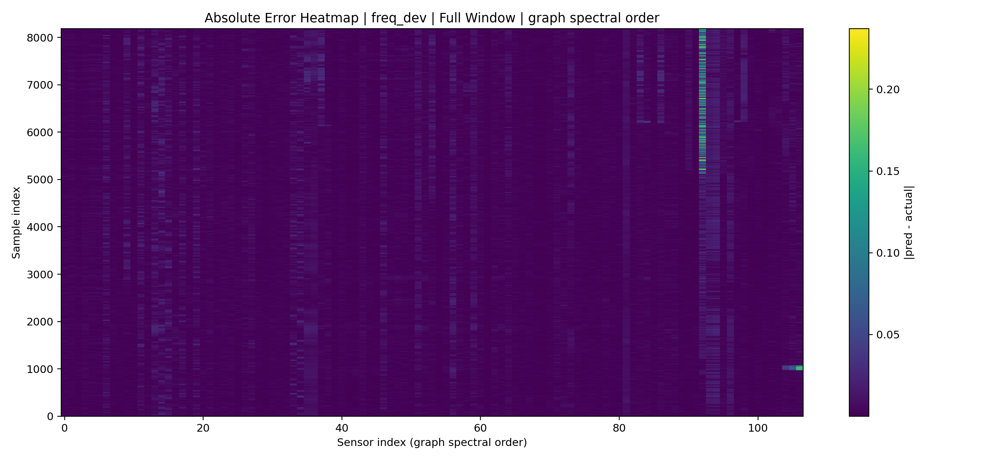

- Voltage overlay and heatmaps:

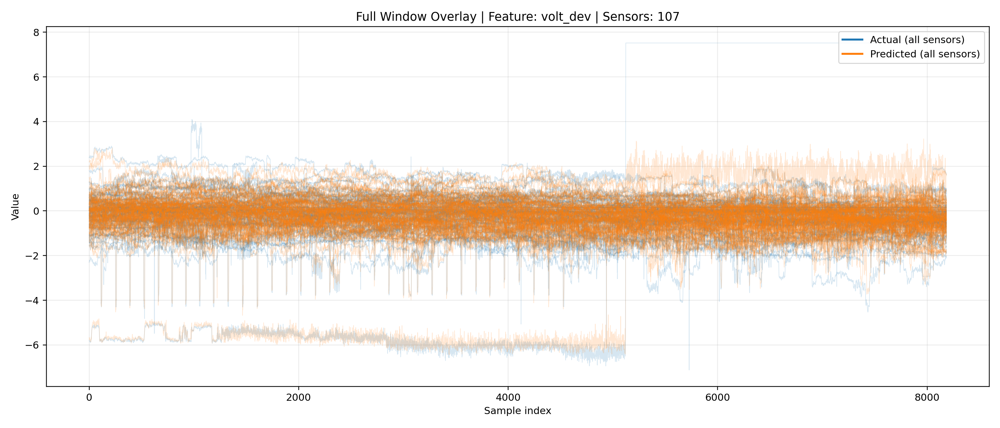

<!-- 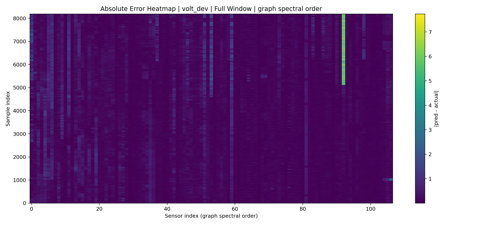 -->

### 3.3 Per-sensor examples

- Example sensor figures (full set: sensor_000 to sensor_106):

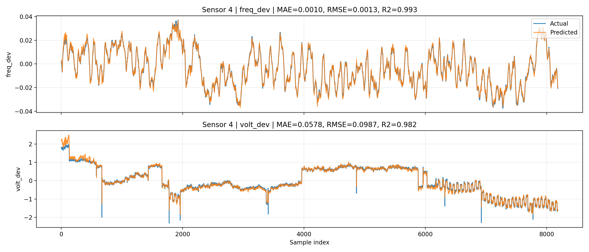

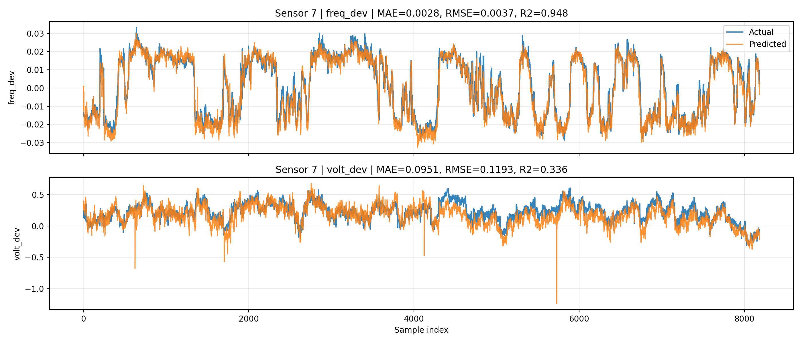

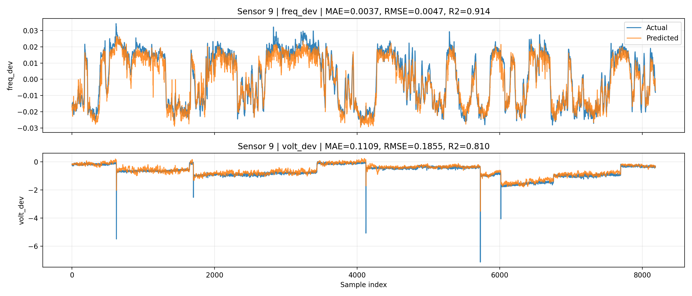

---

## 4) Track B: Downstream Task 1 (Regional Anomalies)

## 4.1 Method summary

Task objective:

- Detect connected sensor clusters when both freq_dev error and RoCoF error are simultaneously high at the same time index.

Pipeline:

1. Load prediction/target arrays.
2. Reduce horizon to one value per sample (default mean).
3. Compute per-sensor absolute freq_dev error.
4. Estimate RoCoF from reduced freq_dev and compute absolute RoCoF error.
5. Activate sensors exceeding high quantile thresholds in both channels.
6. Build connected components using strong graph edges.
7. Rank components by size-weighted magnitude score.
8. Save cluster tables and cluster plots.

Default data references used in current outputs:

- results_dir: results_masked_cov80_full_scaled
- split_name: test (task summary)
- adjacency: results/A_geo.npy
- sensor order: results/sensor_order.npy

### 4.2 Downstream quantitative outputs

From outputs/summary.json:

- num_samples: 4,087
- num_sensors: 107
- clusters_detected: 28
- clusters_selected: 28

From outputs/thresholds.json:

- freq_threshold: 0.0113578
- rocof_threshold: 0.00330709
- edge_threshold: 0.141400
- quantiles used: freq 0.95, rocof 0.95, edge 0.70

Recurring sensor participation (top):

- 774 (UsNjTomsriver774): 14 clusters
- 1055 (UsNjRedBank1055): 14 clusters
- 984 (UsGaNorcross984): 8 clusters
- 2009 (UsOhCleveland2009): 8 clusters
- 792 (UsVaHaymarket792): 5 clusters
- 1491 (UsDeMillsboro1491): 5 clusters

Representative top cluster event:

- cluster_id 18 at 2024-01-01 20:05:27
- cluster_size 2
- score 0.06819
- mean_freq_dev 0.02952
- mean_rocof_dev 0.00458
- sensors: 774 and 1055

### 4.3 Episode collapse / map-stage outputs

From map_cluster_episodes_current/summary.json:

- input_rows: 18,365
- episodes_after_collapse: 311
- selected_for_plot: 35
- used_episode_gap: 120
- peak_exclusion_window: 180
- overlap_mode: sensor_overlap
- split_name: pred

Interpretation:

- The collapse stage condenses raw pointwise detections into cleaner episode-level events for interpretation and reporting.

---

## 5) Track B Evidence Plots

### 5.2 Episode-level examples (collapsed map episodes)

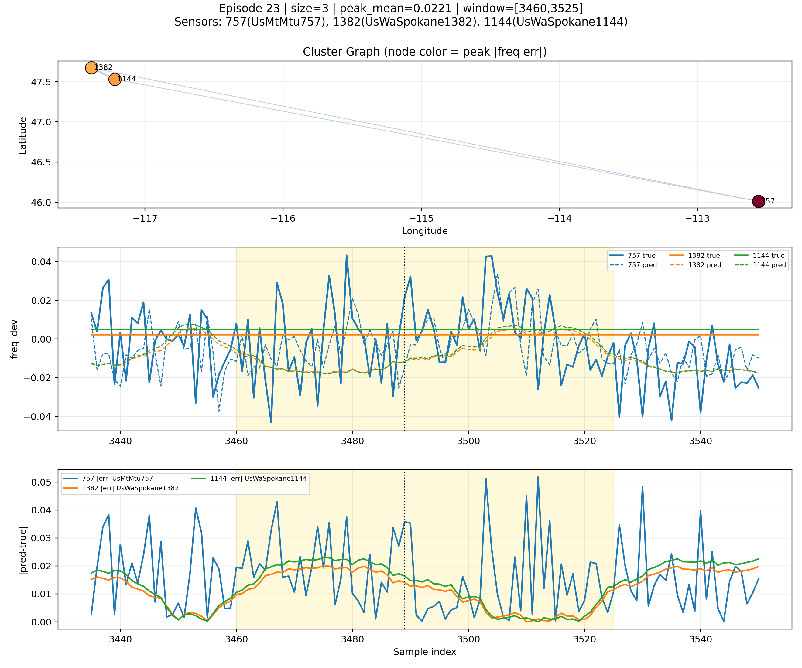

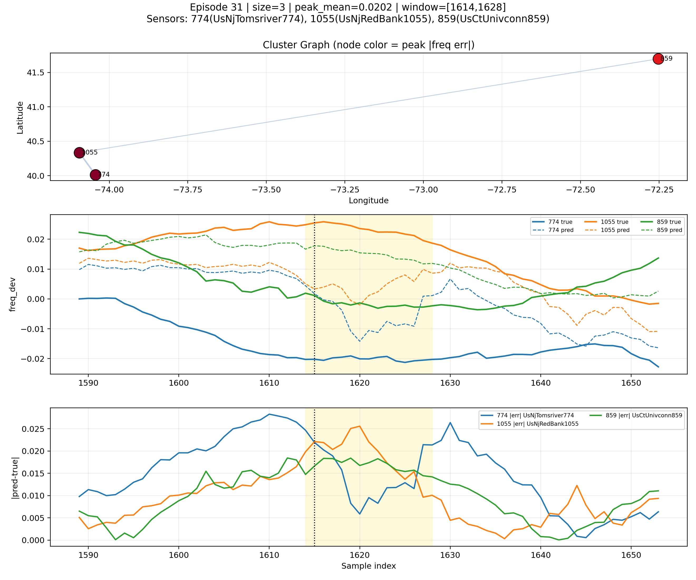

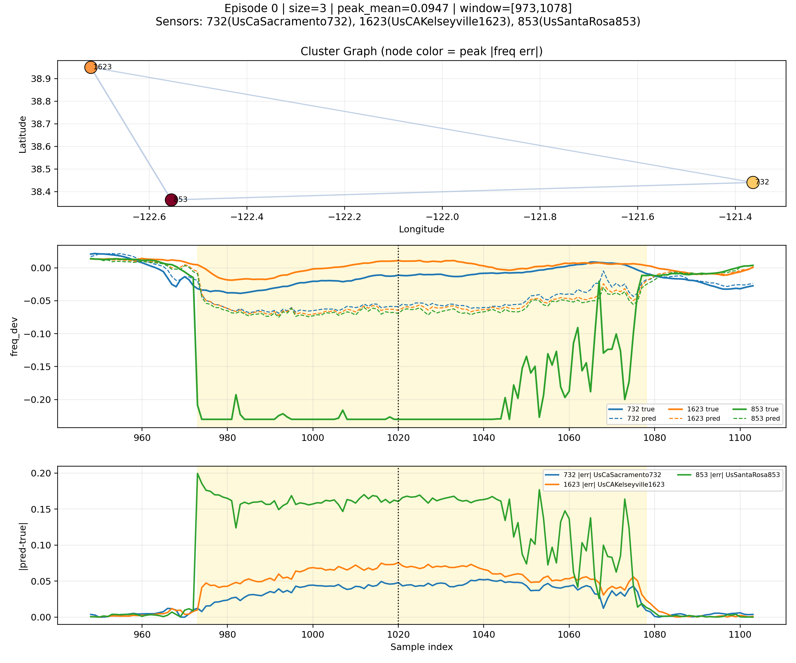

---

## 6) Key Takeaways and Risks

Takeaways:

- The revised cov80 pipeline successfully balances broad coverage and strong predictive quality.
- Frequency behavior is consistently well predicted across most sensors.
- Voltage remains the main source of performance variability across sensors.
- Downstream graph-connected anomaly analysis is producing repeatable, interpretable regional event candidates.

Risks/limitations:

- Some per-sensor voltage R2 outliers are unstable and can distort simple averages.
- Different artifacts use different split contexts (test vs pred), so all comparisons should state split explicitly.
- Maps in test_analysis_cov80/maps_pred are not populated in the current snapshot.

---

## 7) Recommended Next Actions

1. Add robust aggregate stats to per-sensor reporting (median, IQR, trimmed mean) to avoid outlier-driven summaries.
2. Prioritize voltage error reduction on repeatedly weak sensors with targeted diagnostics.
3. Standardize one canonical summary table per split (train/val/test/pred) to avoid confusion across artifacts.
4. Extend downstream clustering sensitivity study over quantiles and min_cluster_size to quantify stability of recurring pairs.
5. Select 5 to 10 episode plots as the fixed supervisor appendix for consistent weekly updates.

---

## 8) Artifact Index (source files)

Main model:

- test_analysis_cov80/figures_pred/summary_metrics.json
- test_analysis_cov80/full_window_all_sensors_pred/full_window_summary.json
- test_analysis_cov80/per_sensor_two_features_pred/summary_per_sensor.json
- results_masked_cov80_full_scaled/config.json

Downstream Task 1:

- downstream_tasks/task1_regional_anomalies/outputs/summary.json
- downstream_tasks/task1_regional_anomalies/outputs/thresholds.json
- downstream_tasks/task1_regional_anomalies/outputs/clusters_top.csv
- downstream_tasks/task1_regional_anomalies/outputs/sensor_participation.csv
- downstream_tasks/task1_regional_anomalies/outputs/map_cluster_episodes_current/summary.json
